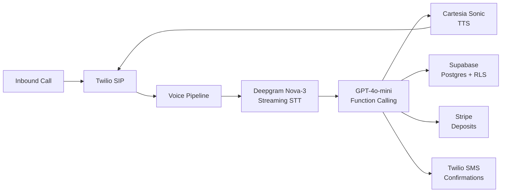

# SuiteBook AI

> AI voice booking agent built for solo salon suite stylists. Every missed call becomes a booked appointment.

**Status:** Live beta · First client in production (Venice, FL) · Active development
**Built by:** [Chris Hegyesi](https://github.com/Chrishegyesi) · A product of [Bradshaw AI](https://bradshawai.com)

---

## What it does

Solo salon stylists miss 30–40% of their inbound calls — they're with a client, hands in someone's hair, phone on silent. Every missed call is a lost booking and often a lost client.

SuiteBook AI is a phone number that answers every call. Maya, the AI agent, handles:

- **Booking** — checks real availability, books the slot, texts a confirmation
- **Rescheduling and cancellation** — without waking the stylist
- **Waitlist** — auto-fills cancellations from waitlist in FIFO order
- **Smart slot fill** — proposes the best adjacent slot if the requested time is taken
- **Client memory** — recognizes returning clients, references their last service
- **SMS fallback** — if the caller prefers texting, Maya handles the whole booking over SMS

The stylist keeps their existing tools (GlossGenius, Booksy, Vagaro). SuiteBook AI sits on top of their current phone number via call forwarding — no migration, no training, no switching cost.

---

## Architecture



**Design decisions:**

| Layer | Chose | Why |
|---|---|---|
| Telephony | Twilio (voice + SMS) | Mature API, reliable SIP trunking, well-documented for real-time audio streams |
| STT | Deepgram Nova-3 (streaming) | Streaming latency + accuracy on phone-quality audio |
| LLM | GPT-4o-mini w/ function calling | Tested OpenAI Realtime API in audio mode and saw ~66% tool-call accuracy in my evals — unacceptable for booking. Text-mode function calling was far more reliable. |
| TTS | Cartesia Sonic | Sub-200ms TTFB, natural prosody for customer-facing calls |
| Orchestration | Custom pipeline | Evaluated LangGraph; the added latency wasn't acceptable inside a voice loop |
| Database | Supabase Postgres | Needed EXCLUDE USING gist constraints for double-booking prevention |
| Frontend | Next.js 15 + React 19 PWA | Ships to iOS + Android + desktop with one codebase, no app-store friction |

---

## The double-booking problem (and why it matters)

Any booking system has a hidden race condition: two calls come in at the same second asking for the 2pm Friday slot. Naïve implementations book both. SuiteBook uses Postgres-native constraints so the database itself refuses to allow it:

```sql
-- Simplified — the real schema has more columns
CREATE TABLE bookings (
  id uuid PRIMARY KEY,
  stylist_id uuid NOT NULL,
  start_at timestamptz NOT NULL,
  end_at timestamptz NOT NULL,
  status text NOT NULL,
  EXCLUDE USING gist (
    stylist_id WITH =,
    tstzrange(start_at, end_at) WITH &&
  ) WHERE (status = 'confirmed')
);
```

Combined with SELECT ... FOR UPDATE in the booking transaction, this is provably safe under concurrent load. No application-layer locking, no race conditions.

---

## Stylist-facing PWA

The stylist app is a 6-step onboarding and a 4-tab dashboard:

**Onboarding (~5 min):** Account → business info → services + pricing → hours → AI settings → phone number reveal + Instagram bio copy + go-live checklist.

**Dashboard tabs:**
- **Calendar** — weekly view, real-time, tap any slot to book manually
- **Ask AI** — conversational interface: "book Sarah for a balayage next Tuesday at 2"
- **Clients** — searchable history with lifetime revenue per client
- **Stats** — calls handled, bookings made, revenue booked today/week/month

Three booking paths all write to the same Supabase table:
1. AI inbound (call or SMS → Maya → auto-book)
2. Conversational (stylist chats with AI in the app)
3. Manual form (tap calendar slot → modal)

---

## Tech stack

**Frontend:** Next.js 15, React 19, TypeScript strict mode, Tailwind v4, PWA

**Backend:** Supabase (Postgres + RLS + Realtime), Upstash Redis, Vercel edge functions

**AI:** OpenAI GPT-4o-mini (function calling), Deepgram Nova-3, Cartesia Sonic

**Telephony:** Twilio (voice + SMS)

**Payments:** Stripe (deposits, subscriptions)

**Dev:** Claude Code multi-agent workflow, governance files (CLAUDE.md, DECISIONS.md, PROGRESS.md), TypeScript strict, multi-agent parallel feature development

---

## What makes this defensible

Two things SuiteBook AI has that the big booking platforms don't:

1. **Color formula vault.** Hair colorists store the exact formula used per visit per client. Switching costs compound over time — leaving means losing years of formulas.
2. **Solo-operator focus.** Big booking platforms (Vagaro, Booksy, GlossGenius) are built for multi-chair salons. Solo suite stylists are a different workflow — we're purpose-built for one person, one calendar, one phone number.

---

## Roadmap

- [x] Voice agent MVP (Maya v1)
- [x] Live beta in Venice, FL
- [x] Stylist PWA with 3 booking paths
- [x] Stripe deposit flow
- [ ] Multi-location support for multi-suite operators
- [ ] Color formula vault v1
- [ ] Instagram DM booking channel
- [ ] Waitlist auto-fill intelligence

---

## About the builder

I'm [Chris](https://github.com/Chrishegyesi) — 20, based in Venice, FL, Codesmith immersive grad (2025). I run [Bradshaw AI](https://bradshawai.com), an AI automation agency serving SW Florida service businesses. SuiteBook AI is the vertical SaaS arm of that agency, starting with salons and expanding into home services, dental, and legal.

Reach me: christopherhegyesii@gmail.com · [LinkedIn](https://linkedin.com/in/christopher-hegyesi)

---

*Source code is private. This repo is the technical overview. Live demo available on request.*
